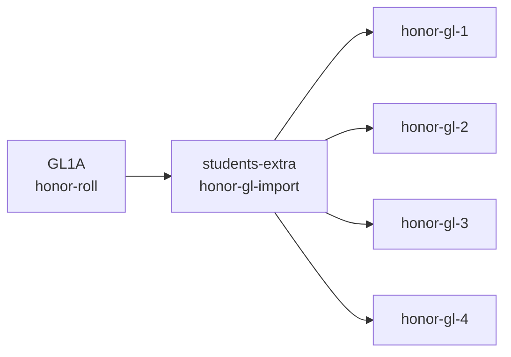

## I. Administrator's responsibilities

### 1. Assist Teachers (Beginner)

Help teachers use the GLVN class spreadsheets. Administrators should not generate report cards on behalf of teachers. If a teacher prefers not to use Google Sheets, provide blank report cards for manual completion.

### 2. Manage Student Registration (Beginner)

Register new students during the registration period and update student information as needed (for example, email addresses). Keeping email addresses up to date helps prevent bounced emails when teachers send report cards.
 
### 3. Share or Remove Access to Class Folders (Intermediate)

Share or unshare class folders and spreadsheets with teachers.

To share class folders:

Open the students-master spreadsheet.
Go to the gl-classes or vn-classes tab.
Enter X in the Action column.
Select GLVN → Share Classes.

Note: The first time you use a GLVN menu item, Google will ask you to authorize the Google Apps Script. See Section VI for instructions.

### 4. Prepare for a New School Year (Intermediate)

Run the six annual administrator steps in the students-master spreadsheet.

These six steps should be performed only once after the current school year has ended and before student registration begins for the new school year.
 
### 5. Test All Class Spreadsheets (Intermediate)

Test all GLVN menu functions before teachers begin entering student data.

Testing early helps identify and fix issues before data is entered, reducing the risk of data correction later.

### 6. Update Spreadsheet Source Code (Advanced)

Maintain the source code for the following spreadsheets:

students-master
students-extra
class-library

The class-library code is shared by all class spreadsheets. Occasionally, Google does not refresh the library correctly. When this happens, administrators must manually copy the updated source code into every class spreadsheet.

The latest source code is available at:

https://github.com/hungple/GLVN-database

See Section VII for instructions on copying the source code.
 
### 7. Create New GL or VN Classes (Advanced)

Create new class spreadsheets such as GLxC, VNxC, or GL9A (Post-Confirmation).

Clone GL1A to create a new GL class.
Clone VN1A to create a new VN class.
Update all spreadsheet IDs and configuration values accordingly.

See Section VIII for detailed instructions.

### 8. Become a GLVN Database Owner (Expert)

Assume ownership of the GLVN database and spreadsheets.

Note: Although this task is categorized as Expert, the source code is relatively straightforward for anyone with software engineering or programming experience.
 

### II. Owner’s responsibilities:
 
1. Monitor activity across all GLVN spreadsheets.
2. Maintain spreadsheet formulas, functions, formatting, and data integrity.
3. Maintain the source code repository:
   `https://github.com/hungple/GLVN-database`

### III. Authorizing Google apps script

Google may occasionally ask you to authorize or trust the Google Apps Script used by the GLVN spreadsheets.

To authorize the script, either:

Follow the instructions here:
[https://github.com/hungple/GLVN-database/blob/main/authorize-google-app-script.md](https://github.com/hungple/GLVN-database/blob/main/authorizing-google-app-script.md)

or

Watch the first half of this video:
https://www.youtube.com/watch?v=4sFTQ9UAtuo

### IV. Copying source code to Google spreadsheets

Each GLVN spreadsheet displays a `Release Date` in the `GLVN` menu.

If the release date in your spreadsheet is older than the release date in the GitHub source code, you should update the spreadsheet by copying the latest source code.

#### For students-master and students-addition

Copy the corresponding source code directly into the Apps Script editor.

#### For Class Spreadsheets (GL1A, VN1A, etc.)

Normally, you only need to copy `class-library.gs` into the `class-library` spreadsheet because all class spreadsheets use this shared library.

However, if the shared library is not refreshed properly, you must also copy the updated source code into each individual class spreadsheet.

#### To copy the source code
1. Open the source code in GitHub.
2. Select all the code (Ctrl+A) and copy it (Ctrl+C). Alternatively, click Raw, then press Ctrl+A followed by Ctrl+C.
3. Open the target Google spreadsheet.
4. Select Extensions → Apps Script.
5. Click inside the code editor.
6. Press Ctrl+A to select the existing code.
7. Press Ctrl+V to paste the new source code.
8. Press Ctrl+S to save.
9. Close the Apps Script editor.
10. Return to the spreadsheet and refresh your browser.

### V. Dataflow - How the Spreadsheets Are Connected
 
Although the GLVN database contains many spreadsheets, student information is maintained primarily in the `students-master` spreadsheet.

Teachers enter grades and attendance only in their assigned class spreadsheets.

All other spreadsheets automatically import data from the master spreadsheet or other supporting spreadsheets.

**Note:** The examples below use GL1A, but the same data flow applies to all GL and VN classes.

#### Class Spreadsheets (GLxx/VNxx)

## Honor Roll Data Flow

students-master.Std_zzz
        ↓
students-master.studentsclass
        ↓
students-master.GL1A
        ↓
GL1A.contacts
        ↓
GL1A.attendance-HK1
GL1A.attendance-HK2
GL1A.grades

- `students-master`.`Std_zzz` -> `students-master`.`studentsclass` -> `students-master`.`GL1A` -> `GL1A`.`contacts` -> `GL1A`.`attendance-HK1`, `GL1A`.`attendance-HK2`, and `GL1A`.`graces`
 
#### Student Lists / First communion / Confirmation

#### Student Lists

students-master.Std_zzz
        ↓
students-master.students
        ↓
students-extra.students-import
        ↓
students-extra.students-mini
students-extra.students-wide
students-extra.students-registration

#### First Eucharist

students-master.Std_zzz
        ↓
students-master.eucharist
        ↓
students-extra.eucharist-import
        ↓
students-extra.eucharist-certificates

The same process applies to `Confirmation`.

- `students-master`.`Std_zzz` -> `students-master`.`students` -> `students-extra`.`students-import` -> `students-extra`.`students-mini`, `students-extra`.`students-wide`, `students-extra`.`students-registration`. 
- `students-master`.`Std_zzz` -> `students-master`.`eucharist` -> `students-extra`.`eucharist-import` -> `students-extra`.`eucharist-certificates`. The same applies to confirmation as well.
 
#### Final Grade Calculation

GL1A.grades (Column F)
        ↓
students-master.GL1A (Column P)
        ↓
students-master.Std_zzz
(Columns AG and AH)

To save the final scores, select:

GLVN → Save Student Final Points

- `GL1A`.`grades[column F]` -> `students-master`.`GL1A[column P]` ->  `students-master`.`Std_zzz[column AG and AH]` (by selecting GLVN menu item > Save student final points )
 
#### Honor Roll
GL1A.honor-roll
        ↓
students-extra.honor-gl-import
        ↓
honor-gl-1
honor-gl-2
honor-gl-3
honor-gl-4

The same process applies to all VN classes.

- `GL1A`.`honor-roll` -> `students-extra`.`honor-gl-import` -> `students-extra`.`honor-gl-1`, `honor-gl-2`, `honor-gl-3`, `honor-gl-4`. The same applies to VN classes as well.
